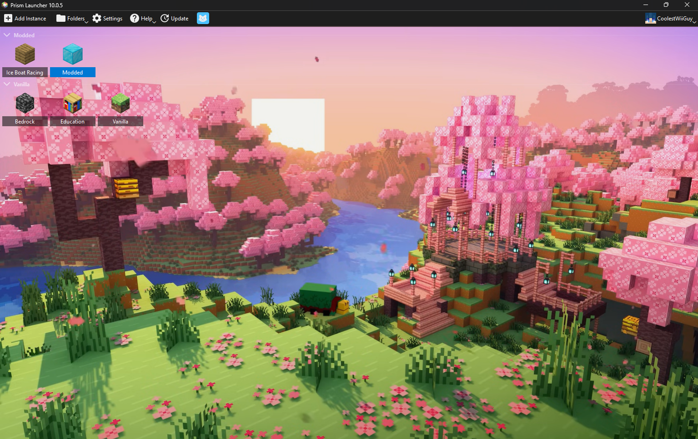

<!--
SPDX-FileCopyrightText: "2026" "@Noahscratch493 (GitHub)"

SPDX-License-Identifier: MIT License
-->

Cherry Grove Theme
---
This is a Prism Launcher BG theme that some how makes it more calming... 😊

## Preview


## Instructions
Put the theme in the "catpacks" folder and then go to:
Settings -> Appearance -> Cat Pack (select Cherry Grove) -> Cat Scaling (Stretch).

## License
```
SPDX-FileCopyrightText: 2026 @Noahscratch493 (GitHub)

SPDX-License-Identifier: MIT License
```
